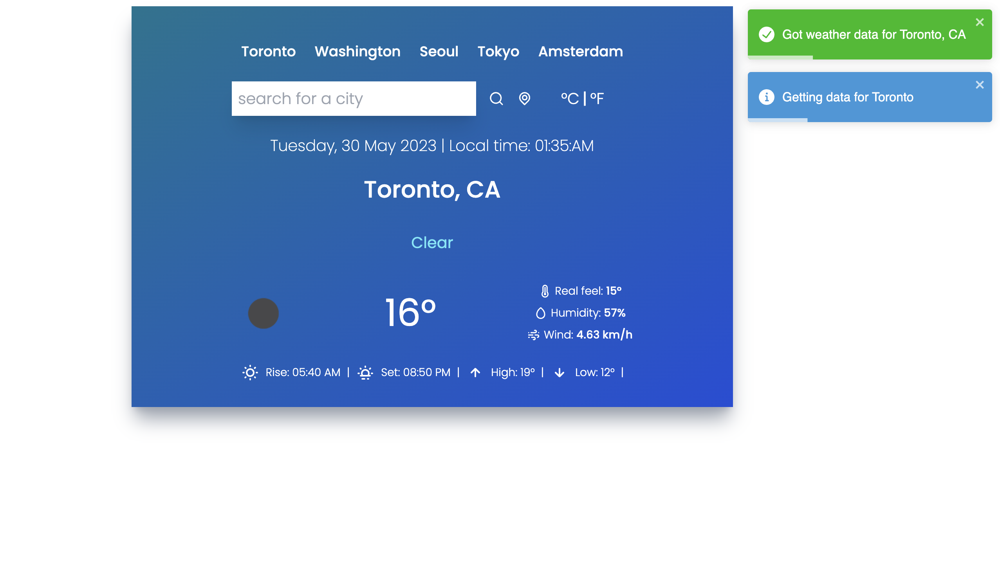

# React-Forecast-App

This Application was was developed with focus on front-end development and consuming third-party API.
It fetches live weather forecast data for searched city or using user location

# Screenshots

### Loading

- Upon clicking preset city or searching city, user will be notified of loading data

- Weather forecasted at below 20°C or 68°F will display cool background-tone to match the forecasted weather

- Weather forecasted at or above 20°C or 68°F will display warm background-tone to match the forecasted weather

# Technology

Technologies Used are: JavaScript, React, Luxon, Toastify

# Next Steps

### Functionality

- Ability to add each user's own preset city for ease of use
- Add future forecasts (Days in advance)

### Styling

- Better optimize responsive design
